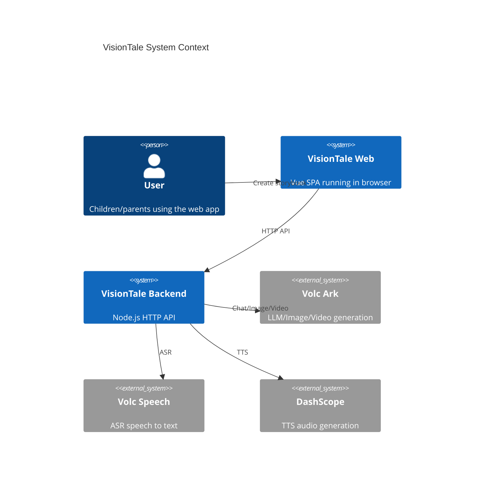
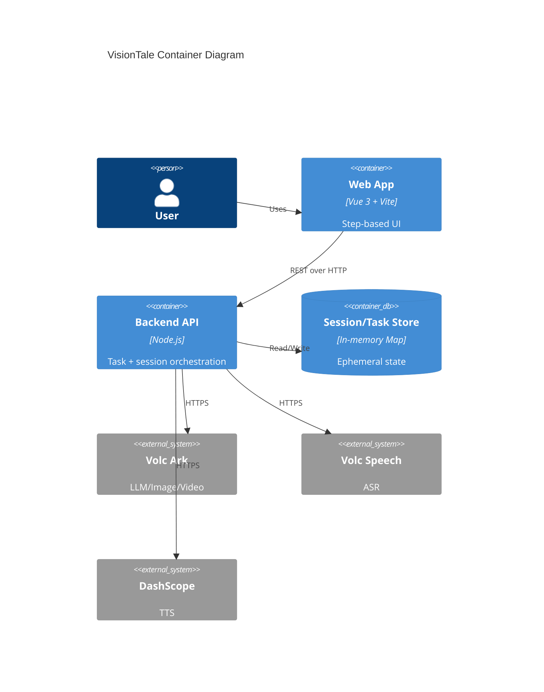
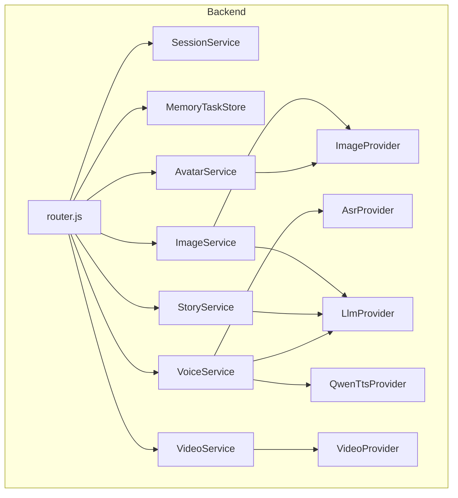

# 架构概览

## 系统上下文 (C4 Level 1)

## 容器架构 (C4 Level 2)

## 组件关系 (C4 Level 3)

## 架构模式
- Step-based pipeline: 前端按步骤推进, 后端按阶段写入 artifacts
- Task polling: 长任务以 taskId + 轮询获取进度
- Ephemeral state: session/task 保存在内存, 通过 TTL 清理
- Artifact namespaces: session.artifacts 按命名空间聚合结果

## 关键设计决策
1. **session.artifacts 作为统一合同**
   - 理由: 前后端共享结构, 便于跨步骤复用
   - 代价: 需要控制单次写入大小, 需要清晰 namespace 规划
2. **task 轮询替代实时推送**
   - 理由: 实现简单, 兼容无 WebSocket 环境
   - 代价: 前端需多次轮询, 增加延迟
3. **localStorage 维持 sessionId**
   - 理由: 页面刷新或跨路由保留流程状态
   - 代价: 无跨设备同步

## 模块拆分
- `visiontale_backend`: API 路由、会话与任务存储、生成服务与 Provider
- `visiontale_front`: Vue SPA, 路由步骤与 UI 组件
