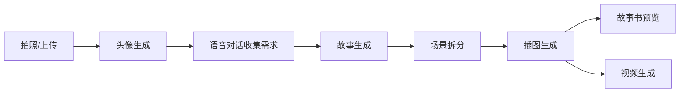
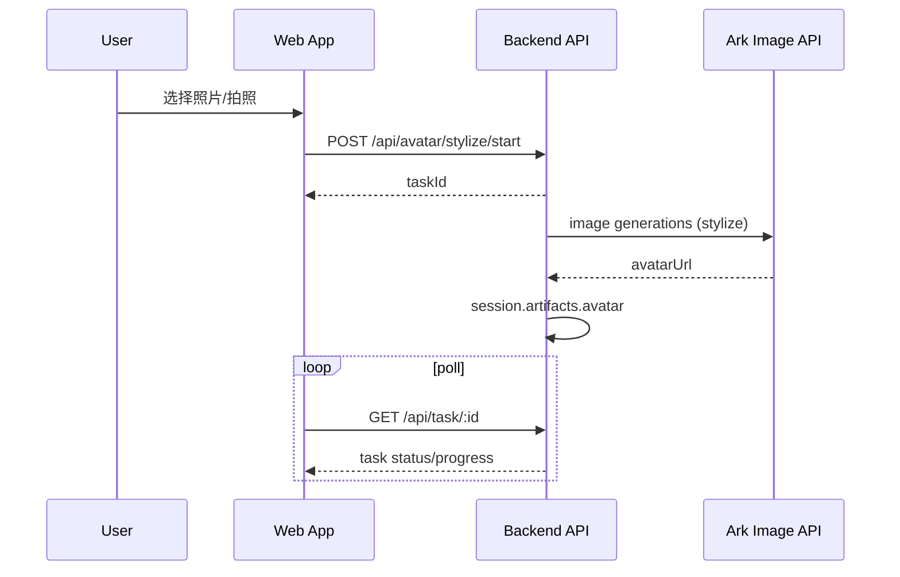
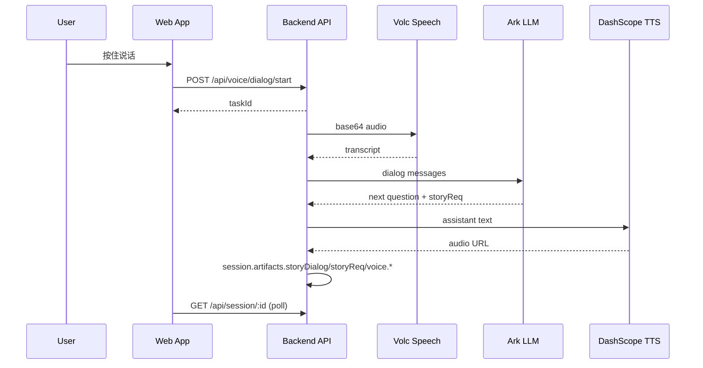
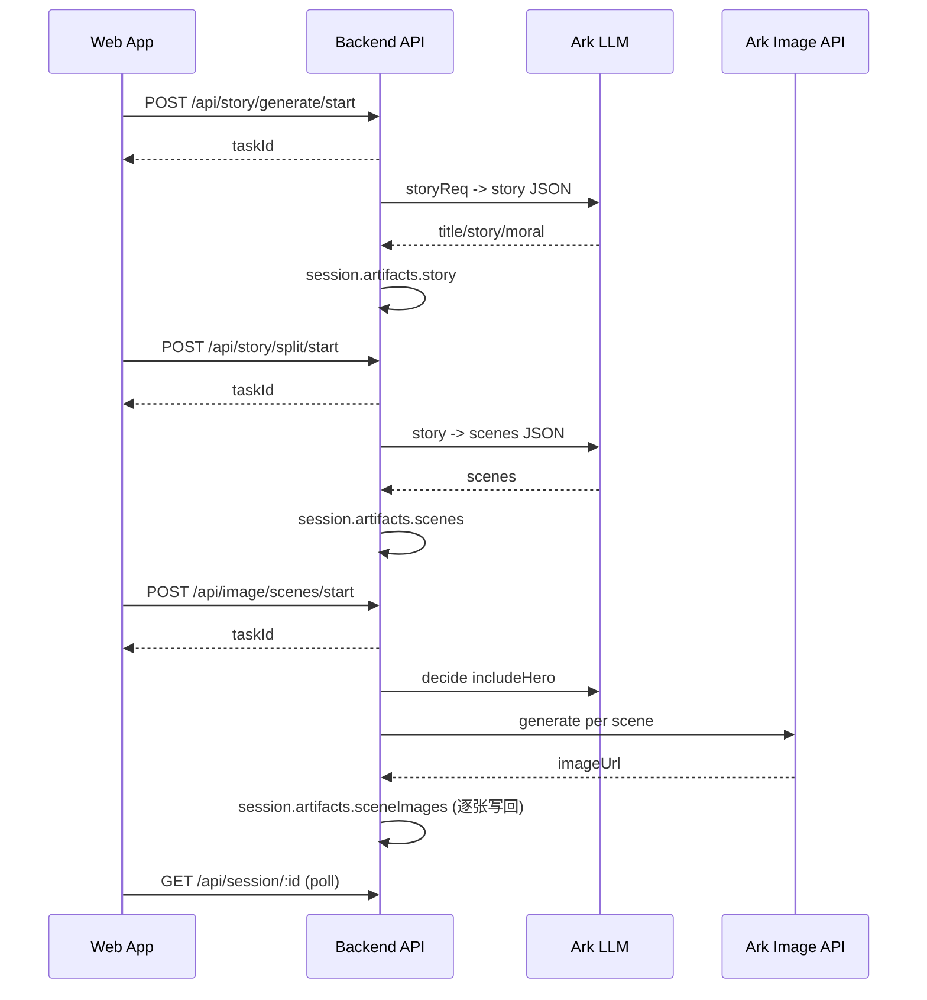
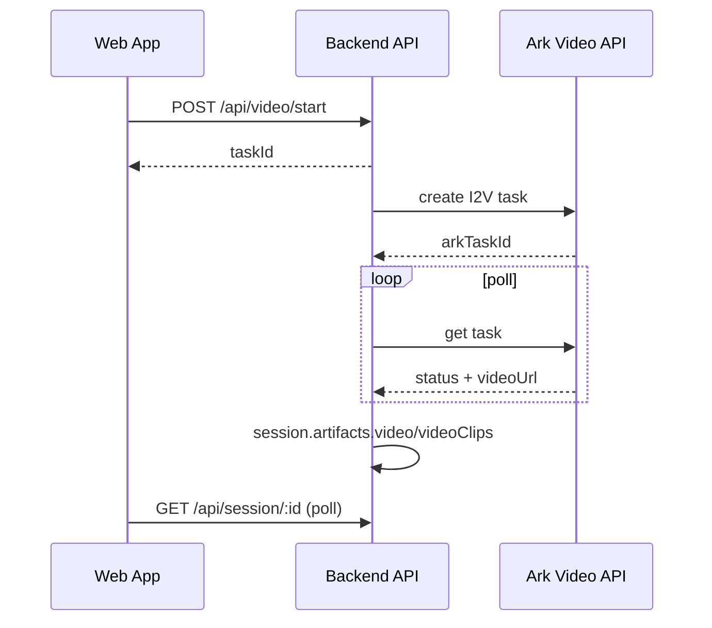
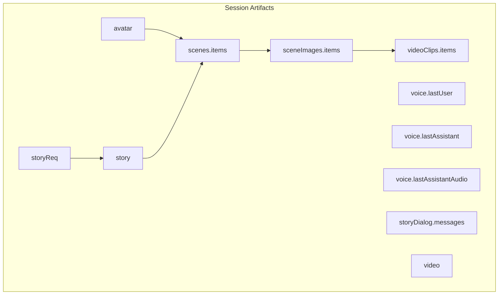

# 流程概览

## 核心流程一览

## Workflow 1: 头像生成

## Workflow 2: 语音对话 (ASR -> LLM -> TTS)

## Workflow 3: 故事 -> 场景 -> 插图

## Workflow 4: 视频生成

## 数据流 (session.artifacts)

## 状态管理
- 前端: localStorage 保存 sessionId, 每个页面各自维护状态与轮询
- 后端: MemorySessionStore + MemoryTaskStore, 支持 TTL 与手动 sweep

## 错误处理策略
- 后端: task.status = FAILED, error 字段返回错误原因
- 前端: 轮询失败或超时显示提示; Images 支持局部失败不中断
