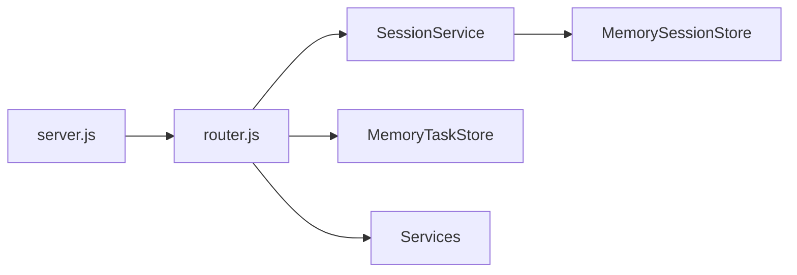

# Deep Dive: Backend Core

## 概览
后端为 Node.js 原生 http 服务, 负责路由分发、session/task 管理、调用生成服务并写回 artifacts。所有状态均保存在内存中, 适合演示或单实例环境。

## 主要职责
- 统一 API 路由与参数校验
- session 管理 (TTL + artifacts 合并)
- task 管理 (进度与结果)
- 错误捕获与 CORS 处理

## 架构图



## 关键文件
- `visiontale_backend/server.js`: http 服务器入口
- `visiontale_backend/src/router.js`: API 路由与任务创建
- `visiontale_backend/src/common/http.js`: CORS/JSON/错误处理
- `visiontale_backend/src/session/MemorySessionStore.js`: 内存 session
- `visiontale_backend/src/session/SessionService.js`: artifacts 与 stage 逻辑
- `visiontale_backend/src/task/MemoryTaskStore.js`: task CRUD

## Session 数据模型

```json
{
  "sessionId": "...",
  "stage": "INIT",
  "artifacts": {
    "avatar": { "url": "..." },
    "storyReq": { "genre": "...", "done": true },
    "story": { "title": "...", "text": "..." },
    "scenes": { "items": [ { "sceneTitle": "..." } ] }
  },
  "createdAt": 0,
  "updatedAt": 0,
  "lastAccessAt": 0,
  "expiresAt": 0
}
```

特性:
- `get()` 默认触发 touch, 会延长 `expiresAt`
- `patch()` 合并 artifacts, 且更新 `updatedAt/lastAccessAt`
- `sweepExpired()` 定时清理过期 session

## Task 数据模型 (示意)

```json
{
  "taskId": "...",
  "sessionId": "...",
  "type": "STORY_GEN",
  "status": "PENDING",
  "progress": 0,
  "stage": "LLM",
  "result": null,
  "error": null,
  "createdAt": 0,
  "updatedAt": 0
}
```

## API 路由总览
- `GET /api/health`: 健康检查
- `GET /api/session/:sessionId`: 读取 session (touch TTL)
- `POST /api/session/:sessionId/artifacts/:namespace`: 写入 artifacts
- `GET /api/tts/test?text=...`: TTS 测试
- `POST /api/avatar/stylize/start`: 头像任务
- `POST /api/voice/dialog/start`: 语音对话任务
- `POST /api/story/generate/start`: 生成故事
- `POST /api/story/split/start`: 拆分场景
- `POST /api/image/scenes/start`: 生成插图
- `GET /api/image/test`: 图像测试
- `POST /api/video/start`: 生成视频
- `GET /api/task/:taskId`: 轮询任务

## 请求与限制
- `imageBase64` 上限约 15MB
- `audioBase64` 上限约 16MB
- artifacts 单次写入限制约 200KB

## 设计注意点
- CORS 默认允许 `*`
- 后端未校验 `X-API-Token` (前端会发送)
- session 与 task 均为内存对象, 实例重启即丢失
- `task/TaskStore.js` 与 `upload/uploadHandler.js` 目前未接入路由

## 潜在改进
- 引入持久化存储 (Redis/DB)
- 统一 task 状态字段 (DONE vs SUCCEEDED)
- 增加鉴权与请求速率限制
