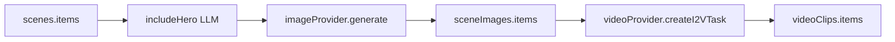

# Deep Dive: Backend Services

## 概览
后端 services 负责实际的生成流程, 以 taskId 异步运行, 并把结果写回 session.artifacts。主要包括 Avatar、Voice、Story、Image、Video 五类服务。

## AvatarService
- 输入: `sessionId`, `imageBase64`, `styleId`, `size`
- 输出: `session.artifacts.avatar = { url, styleId, size }`
- 过程:
  - 创建任务, 更新阶段 `AVATAR_PENDING -> AVATAR_RUNNING -> AVATAR_DONE`
  - 通过 Ark Image API 进行风格化
  - 任务完成后 1 小时自动删除 task

## VoiceService (ASR -> LLM -> TTS)
- 输入: `audioBase64`, `mimeType`
- 输出:
  - `voice.lastUser` (ASR 文本)
  - `storyDialog.messages` (多轮对话)
  - `storyReq` (结构化需求)
  - `voice.lastAssistant` 与 `voice.lastAssistantAudio`
- 关键点:
  - `sanitizeMessages` 确保 LLM messages.content 是 string
  - 解析 LLM JSON, 容错 fallback
  - `storyReq.done` 决定是否进入确认阶段

## StoryService
- 依赖: `session.artifacts.storyReq`
- 输出: `session.artifacts.story = { title, text, moral }`
- 过程:
  - LLM 输出 JSON, 失败时使用原始文本兜底
  - stage: `STORY_GEN_PENDING -> STORY_GEN_RUNNING -> STORY_GEN_DONE`

## ImageService
- 依赖:
  - `session.artifacts.avatar.url`
  - `session.artifacts.scenes.items[]`
- 输出: `session.artifacts.sceneImages.items[]`
- 关键点:
  - LLM 先判断每场景是否需要人类主角 (includeHero)
  - 支持断点续跑: sceneId/order 双保险
  - 网络错误重试 (指数退避 + jitter)
  - 局部失败不中断, 允许 partial success

## VideoService
- 依赖: `sceneImages.items` + `scenes.items`
- 输出:
  - `session.artifacts.video`
  - `session.artifacts.videoClips.items`
- 过程:
  - 对每张图创建 Ark I2V task, 轮询直到成功
  - 状态写入 `creating/polling/succeeded/failed`

## Image/Video 生成流程示意

## 依赖 Provider
- `ImageProvider`: Ark Images API (HTTPS JSON)
- `VideoProvider`: Ark Content Generation API
- `LlmProvider`: Ark Chat Completions
- `AsrProvider`: Volc Speech ASR
- `QwenTtsProvider`: DashScope TTS

## 潜在改进
- 统一 task 生命周期清理策略
- 对 sceneImages 失败项提供重试 API
- 对 LLM 输出 schema 做更严格校验
