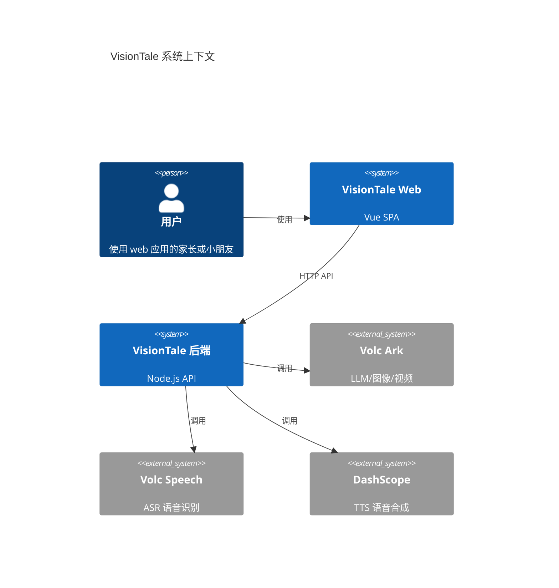
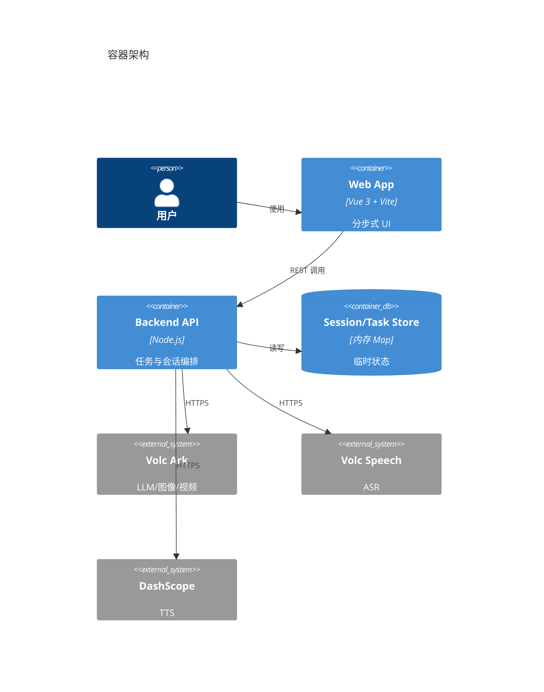
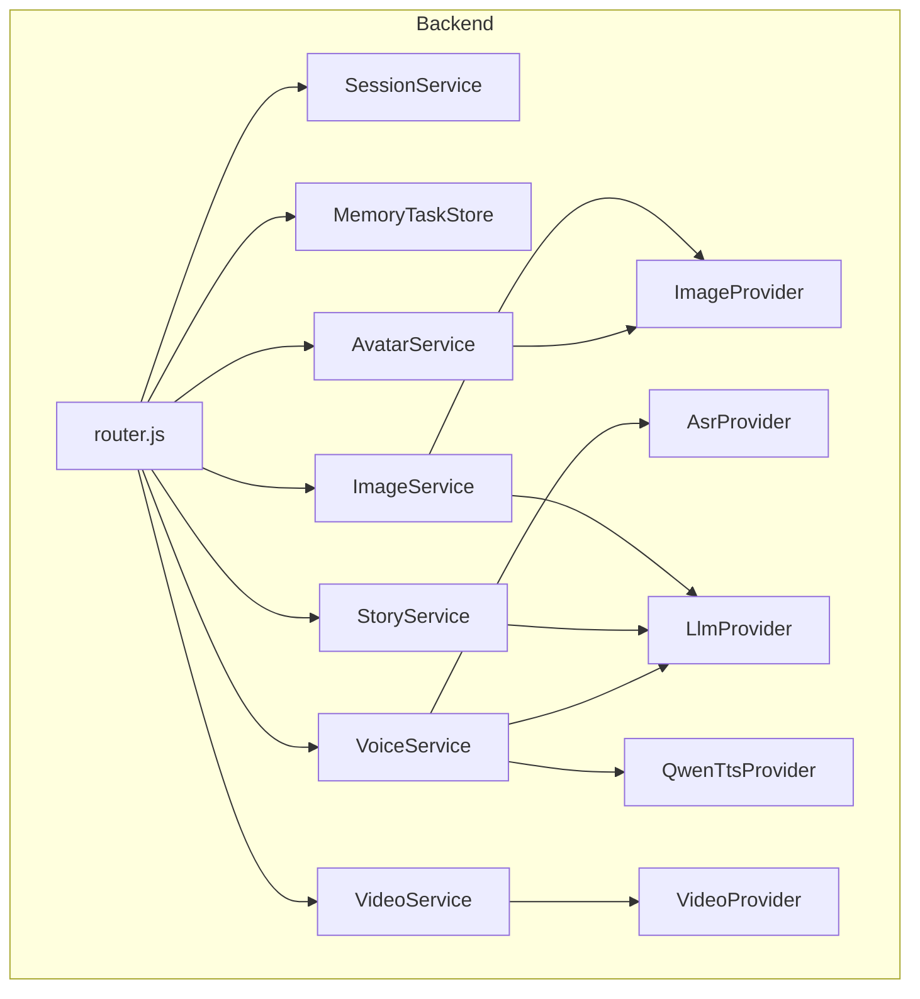
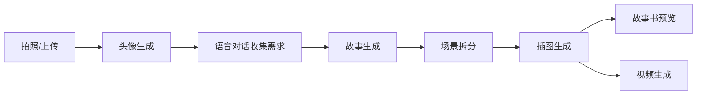
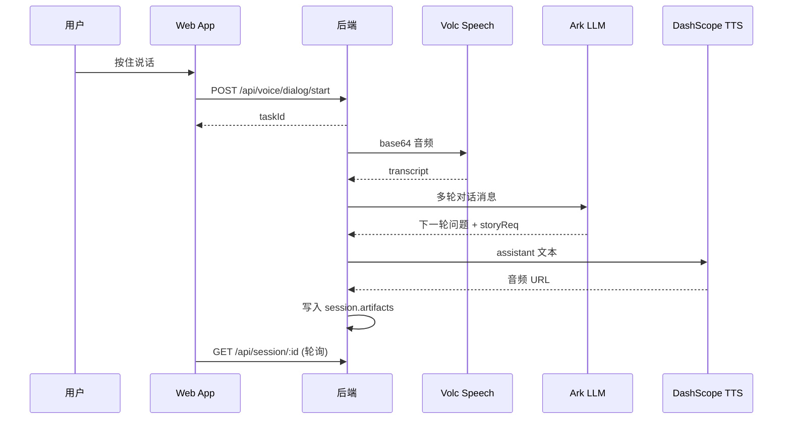
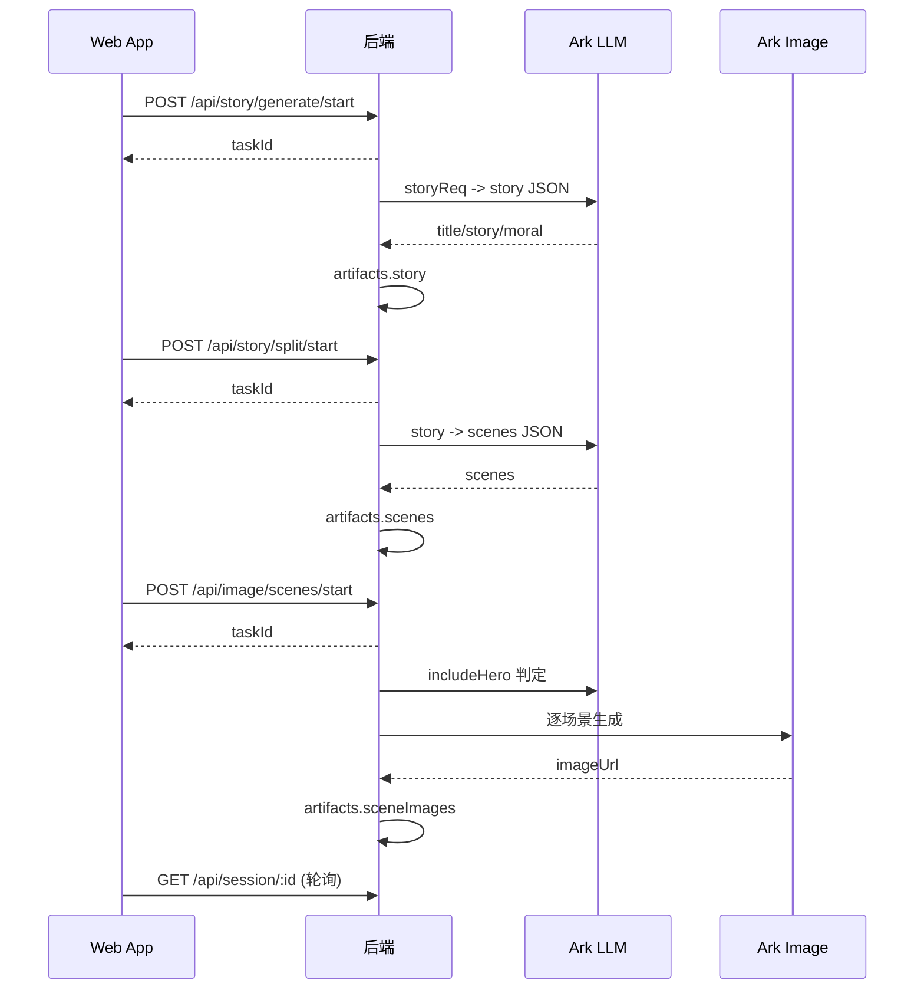

# VisionTale 项目文档（中文）

## 项目简介
VisionTale 是一个多步骤的 AI 故事书生成工具。用户通过拍照或上传图片获得卡通头像，通过语音对话逐步收集故事需求，然后自动生成故事、拆分场景、生成插图，最终可以预览故事书或生成视频片段。

核心目标:
- 降低故事创作门槛, 用尽量少的输入完成一本故事书
- 使用统一 session 贯穿各步骤, 保持上下文一致
- 通过 task 轮询机制向前端提供生成进度

## 技术栈
- 前端: Vue 3, Vite, Vue Router
- 后端: Node.js 原生 http 服务
- 外部服务: Volc Ark (LLM/图像/视频), Volc Speech (ASR), DashScope (TTS)
- 存储: 内存 session/task store (无持久化)

## 项目结构
```
.
├── visiontale_backend/
│   ├── server.js
│   └── src/
│       ├── router.js
│       ├── common/http.js
│       ├── session/
│       ├── task/
│       ├── avatar/
│       ├── voice/
│       ├── story/
│       ├── image/
│       ├── video/
│       └── upload/
└── visiontale_front/
    ├── index.html
    ├── package.json
    └── src/
        ├── main.js
        ├── App.vue
        ├── router/index.js
        ├── layouts/
        ├── components/
        ├── pages/
        └── styles/global.css
```

## 快速开始

### 后端
```
cd visiontale_backend
npm install
npm start
```

常用环境变量:
- `ARK_API_KEY`, `ARK_BASE_URL`, `ARK_LLM_MODEL`, `ARK_IMAGE_MODEL`, `ARK_VIDEO_MODEL`
- `VOLC_SPEECH_APP_ID`, `VOLC_SPEECH_ACCESS_KEY`, `ASR_RESOURCE_ID`
- `DASHSCOPE_API_KEY` (TTS)
- `SESSION_TTL_MS`

### 前端
```
cd visiontale_front
npm install
npm run dev
```

可在 `visiontale_front/.env.local` 配置:
- `VITE_API_BASE` (后端地址)
- `VITE_API_TOKEN` (可选, 后端暂未做校验)

## 架构概览

### 系统上下文 (C4 Level 1)


### 容器架构 (C4 Level 2)


### 组件关系 (C4 Level 3)


## 核心流程

### 全流程概览


### 语音对话 (ASR -> LLM -> TTS)


### 故事 -> 场景 -> 插图


## 数据模型

### Session (示意)
```json
{
  "sessionId": "...",
  "stage": "INIT",
  "artifacts": {
    "avatar": { "url": "..." },
    "storyReq": { "genre": "...", "done": true },
    "story": { "title": "...", "text": "..." },
    "scenes": { "items": [ { "sceneTitle": "..." } ] }
  },
  "createdAt": 0,
  "updatedAt": 0,
  "lastAccessAt": 0,
  "expiresAt": 0
}
```

### Task (示意)
```json
{
  "taskId": "...",
  "sessionId": "...",
  "type": "STORY_GEN",
  "status": "PENDING",
  "progress": 0,
  "stage": "LLM",
  "result": null,
  "error": null,
  "createdAt": 0,
  "updatedAt": 0
}
```

## API 端点概览
- `GET /api/health`: 健康检查
- `GET /api/session/:sessionId`: 读取 session (touch TTL)
- `POST /api/session/:sessionId/artifacts/:namespace`: 写入 artifacts
- `GET /api/tts/test?text=...`: TTS 测试
- `POST /api/avatar/stylize/start`: 头像任务
- `POST /api/voice/dialog/start`: 语音对话任务
- `POST /api/story/generate/start`: 生成故事
- `POST /api/story/split/start`: 拆分场景
- `POST /api/image/scenes/start`: 生成插图
- `GET /api/image/test`: 图像测试
- `POST /api/video/start`: 生成视频
- `GET /api/task/:taskId`: 轮询任务

## 前端路由与 artifacts

| 路由 | 页面 | 主要 API | 关键 artifacts |
| --- | --- | --- | --- |
| `/photo` | Photo.vue | POST `/api/avatar/stylize/start`, GET `/api/task/:id` | `avatar` |
| `/dialog` | Dialog.vue | POST `/api/voice/dialog/start`, GET `/api/task/:id`, GET `/api/session/:id` | `storyDialog`, `storyReq`, `voice.*` |
| `/story` | Story.vue | POST `/api/story/generate/start`, GET `/api/task/:id`, POST `/api/session/:id/artifacts/story` | `story` |
| `/split` | Split.vue | POST `/api/story/split/start`, GET `/api/task/:id`, POST `/api/session/:id/artifacts/scenes` | `scenes` |
| `/images` | Images.vue | POST `/api/image/scenes/start`, GET `/api/task/:id`, GET `/api/session/:id` | `sceneImages` |
| `/storybook` | Storybook.vue | GET `/api/session/:id` | `story`, `scenes`, `sceneImages` |
| `/video` | Video.vue | POST `/api/video/start`, GET `/api/task/:id`, GET `/api/session/:id` | `videoClips` |

## 后端服务详解

### AvatarService
- 输入: `sessionId`, `imageBase64`, `styleId`, `size`
- 输出: `artifacts.avatar = { url, styleId, size }`
- 调用 Ark Image 进行风格化

### VoiceService
- 输入: `audioBase64`, `mimeType`
- 输出: `storyDialog.messages`, `storyReq`, `voice.last*`
- 逻辑: ASR -> LLM 多轮 -> TTS

### StoryService
- 依赖: `storyReq`
- 输出: `artifacts.story = { title, text, moral }`
- 使用 LLM 输出 JSON, 失败则兜底解析

### ImageService
- 依赖: `avatar.url`, `scenes.items`
- 输出: `sceneImages.items` (逐张写回)
- 支持断点续跑与网络重试

### VideoService
- 依赖: `sceneImages.items` + `scenes.items`
- 输出: `videoClips.items` + `video`
- 逐场景 I2V 任务, 轮询完成

## Provider 集成

### Volc Ark (LLM/图像/视频)
- `ARK_CHAT_ENDPOINT` (默认 `/api/v3/chat/completions`)
- `ARK_IMAGE_ENDPOINT` (默认 `/api/v3/images/generations`)
- `ARK_BASE_URL + /contents/generations/tasks`

常用环境变量:
- `ARK_API_KEY`, `ARK_BASE_URL`, `ARK_LLM_MODEL`, `ARK_IMAGE_MODEL`, `ARK_VIDEO_MODEL`, `ARK_TIMEOUT_MS`

### Volc Speech (ASR)
- 端点: `https://openspeech.bytedance.com/api/v3/auc/bigmodel/recognize/flash`
- 头部: `X-Api-App-Id`, `X-Api-Access-Key`, `X-Api-Resource-Id`
- 输入: base64 音频 (不带 dataURL 前缀)

### DashScope TTS (Qwen3)
- 端点: `https://dashscope.aliyuncs.com/api/v1/services/aigc/multimodal-generation/generation`
- 模型: `qwen3-tts-flash`
- 输出: wav 音频 URL

## 状态管理与错误处理
- sessionId 通过 localStorage 保存 (`visiontale_session_id`)
- 前端通过轮询 `/api/task/:id` 与 `/api/session/:id` 获取进度与产物
- 后端通过 task.status = FAILED 与 error 字段返回错误
- ImageService 支持局部失败不中断, 写入错误到 `sceneImages.items`

## 注意事项
- session/task 为内存存储, 实例重启即丢失
- `X-API-Token` 前端会发送, 后端未验证
- `visiontale_backend/src/task/TaskStore.js` 与 `upload/uploadHandler.js` 当前未接入路由

## 潜在改进建议
- 引入持久化存储 (Redis/数据库)
- 统一 task status (DONE vs SUCCEEDED)
- 抽离前端轮询逻辑为 composable
- 增加鉴权与速率限制
