# VisionTale 项目文档

## 项目概览

### VisionTale 是什么
VisionTale 是一个多步骤的 AI 故事书生成工具。用户通过拍照或上传图片获得卡通头像，通过语音对话逐步收集故事需求，然后自动生成故事、拆分场景、生成插图，最终可以预览故事书或生成视频片段。

### 核心目的
- 降低故事创作门槛，用尽量少的输入完成一本故事书
- 用统一 session 贯穿各步骤，避免跨页面状态难同步
- 通过 task 轮询机制让前端在生成过程中持续更新进度

### 技术栈
- 前端: Vue 3, Vite, Vue Router (SPA)
- 后端: Node.js 原生 http 服务
- 外部服务: Volc Ark (LLM/图像/视频), Volc Speech ASR, DashScope TTS
- 存储: 纯内存 session/task store (无持久化)

### 关键特性
- 头像生成: 上传/拍照后进行漫画风格化
- 语音对话: ASR + LLM 多轮对话收集 storyReq
- 故事生成: 结构化 JSON 输出
- 场景拆分: 生成 sceneTitle/sceneText/imagePrompt/narration
- 插图生成: 逐场景生成，支持断点续跑
- 故事书预览: 翻页与打印导出 PDF
- 视频生成: I2V 逐场景生成视频片段

### 架构摘要
- 前端以路由步骤组织流程, 每步调用对应 API
- 后端基于 session/artifacts 存储流程状态, task 用于长任务进度
- 生成相关的外部调用都集中在后端 services/providers

### 项目结构
```
.
├── visiontale_backend/
│   ├── server.js
│   └── src/
│       ├── router.js
│       ├── common/http.js
│       ├── session/
│       ├── task/
│       ├── avatar/
│       ├── voice/
│       ├── story/
│       ├── image/
│       ├── video/
│       └── upload/
└── visiontale_front/
    ├── index.html
    ├── package.json
    └── src/
        ├── main.js
        ├── App.vue
        ├── router/index.js
        ├── layouts/
        ├── components/
        ├── pages/
        └── styles/global.css
```

### 快速开始

#### 后端
```
cd visiontale_backend
npm install
npm start
```

常用环境变量 (实际以运行环境为准):
- `ARK_API_KEY`, `ARK_BASE_URL`, `ARK_LLM_MODEL`, `ARK_IMAGE_MODEL`, `ARK_VIDEO_MODEL`
- `VOLC_SPEECH_APP_ID`, `VOLC_SPEECH_ACCESS_KEY`, `ASR_RESOURCE_ID`
- `DASHSCOPE_API_KEY` (TTS)
- `SESSION_TTL_MS`

#### 前端
```
cd visiontale_front
npm install
npm run dev
```

可在 `visiontale_front/.env.local` 配置:
- `VITE_API_BASE` (后端地址)
- `VITE_API_TOKEN` (可选, 当前后端未做校验)

## 架构概览

### 系统上下文 (C4 Level 1)
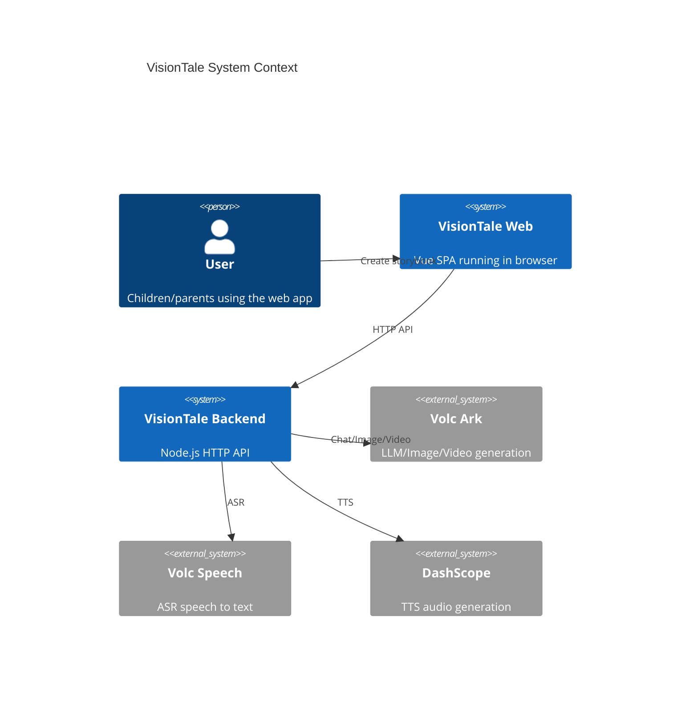
```mermaid
C4Context
  title VisionTale System Context

  Person(user, "User", "Children/parents using the web app")
  System(frontend, "VisionTale Web", "Vue SPA running in browser")
  System(backend, "VisionTale Backend", "Node.js HTTP API")

  System_Ext(ark, "Volc Ark", "LLM/Image/Video generation")
  System_Ext(volc, "Volc Speech", "ASR speech to text")
  System_Ext(dash, "DashScope", "TTS audio generation")

  Rel(user, frontend, "Create storybook")
  Rel(frontend, backend, "HTTP API")
  Rel(backend, ark, "Chat/Image/Video")
  Rel(backend, volc, "ASR")
  Rel(backend, dash, "TTS")
```

### 容器架构 (C4 Level 2)
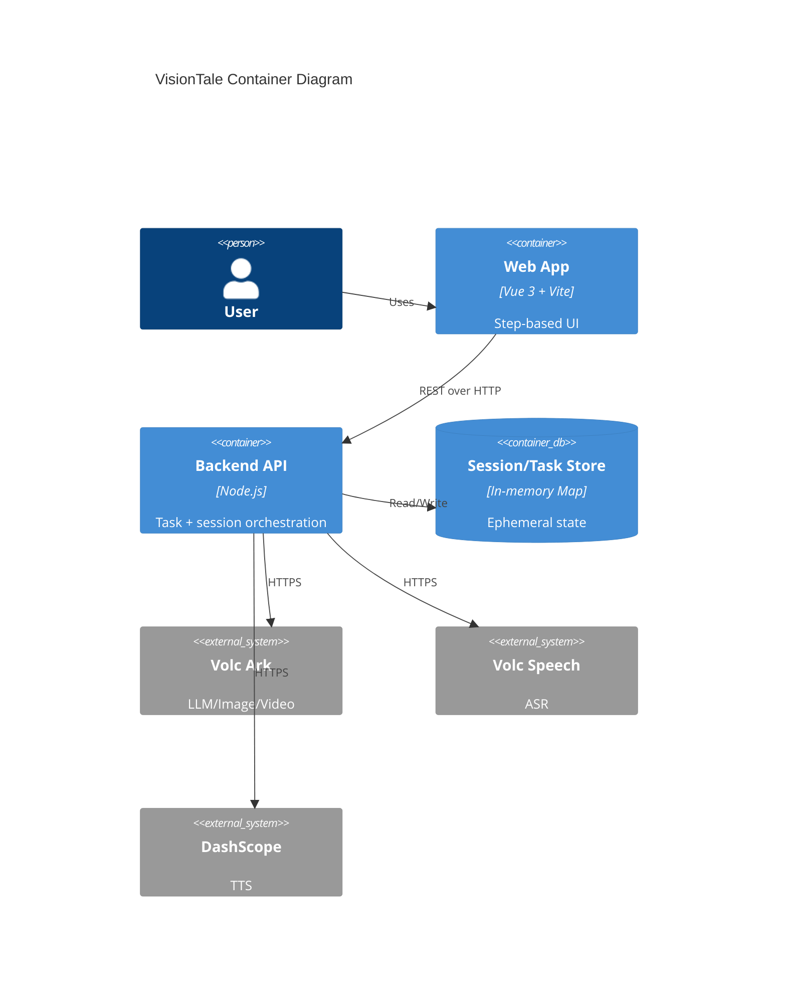
```mermaid
C4Container
  title VisionTale Container Diagram

  Person(user, "User")
  Container(spa, "Web App", "Vue 3 + Vite", "Step-based UI")
  Container(api, "Backend API", "Node.js", "Task + session orchestration")
  ContainerDb(mem, "Session/Task Store", "In-memory Map", "Ephemeral state")

  System_Ext(ark, "Volc Ark", "LLM/Image/Video")
  System_Ext(volc, "Volc Speech", "ASR")
  System_Ext(dash, "DashScope", "TTS")

  Rel(user, spa, "Uses")
  Rel(spa, api, "REST over HTTP")
  Rel(api, mem, "Read/Write")
  Rel(api, ark, "HTTPS")
  Rel(api, volc, "HTTPS")
  Rel(api, dash, "HTTPS")
```

### 组件关系 (C4 Level 3)
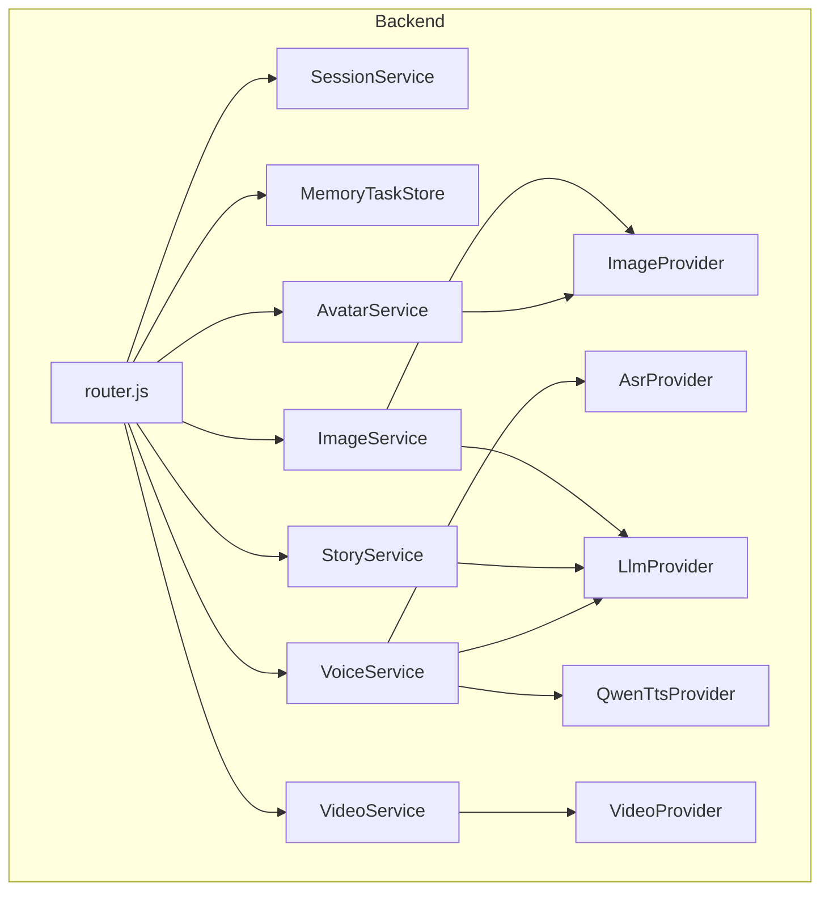
```mermaid
graph TB
  subgraph Backend
    R[router.js]
    SS[SessionService]
    TS[MemoryTaskStore]
    AS[AvatarService]
    VS[VoiceService]
    STS[StoryService]
    IS[ImageService]
    VDS[VideoService]
    IP[ImageProvider]
    VP[VideoProvider]
    LLM[LlmProvider]
    ASR[AsrProvider]
    TTS[QwenTtsProvider]
  end

  R --> SS
  R --> TS
  R --> AS
  R --> VS
  R --> STS
  R --> IS
  R --> VDS

  AS --> IP
  VS --> ASR
  VS --> LLM
  VS --> TTS
  STS --> LLM
  IS --> IP
  IS --> LLM
  VDS --> VP
```

### 架构模式
- Step-based pipeline: 前端按步骤推进, 后端按阶段写入 artifacts
- Task polling: 长任务以 taskId + 轮询获取进度
- Ephemeral state: session/task 保存在内存, 通过 TTL 清理
- Artifact namespaces: session.artifacts 按命名空间聚合结果

### 关键设计决策
1. **session.artifacts 作为统一合同**
   - 理由: 前后端共享结构, 便于跨步骤复用
   - 代价: 需要控制单次写入大小, 需要清晰 namespace 规划
2. **task 轮询替代实时推送**
   - 理由: 实现简单, 兼容无 WebSocket 环境
   - 代价: 前端需多次轮询, 增加延迟
3. **localStorage 维持 sessionId**
   - 理由: 页面刷新或跨路由保留流程状态
   - 代价: 无跨设备同步

### 模块拆分
- `visiontale_backend`: API 路由、会话与任务存储、生成服务与 Provider
- `visiontale_front`: Vue SPA, 路由步骤与 UI 组件

## 流程概览

### 核心流程一览
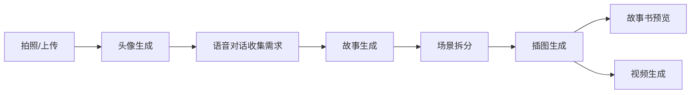
```mermaid
flowchart LR
  A[拍照/上传] --> B[头像生成]
  B --> C[语音对话收集需求]
  C --> D[故事生成]
  D --> E[场景拆分]
  E --> F[插图生成]
  F --> G[故事书预览]
  F --> H[视频生成]
```

### Workflow 1: 头像生成
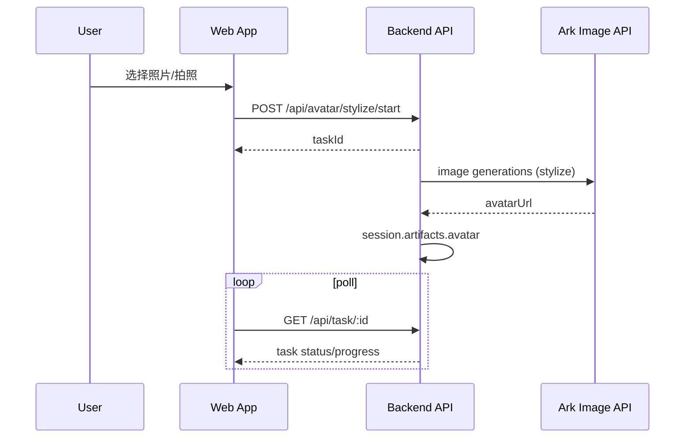
```mermaid
sequenceDiagram
  participant U as User
  participant F as Web App
  participant B as Backend API
  participant Ark as Ark Image API

  U->>F: 选择照片/拍照
  F->>B: POST /api/avatar/stylize/start
  B-->>F: taskId
  B->>Ark: image generations (stylize)
  Ark-->>B: avatarUrl
  B->>B: session.artifacts.avatar
  loop poll
    F->>B: GET /api/task/:id
    B-->>F: task status/progress
  end
```

### Workflow 2: 语音对话 (ASR -> LLM -> TTS)
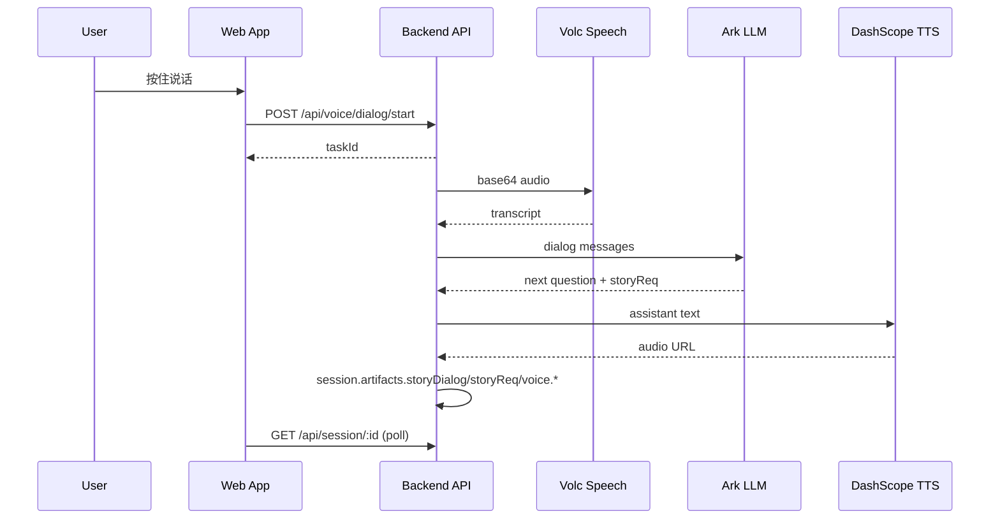
```mermaid
sequenceDiagram
  participant U as User
  participant F as Web App
  participant B as Backend API
  participant ASR as Volc Speech
  participant LLM as Ark LLM
  participant TTS as DashScope TTS

  U->>F: 按住说话
  F->>B: POST /api/voice/dialog/start
  B-->>F: taskId
  B->>ASR: base64 audio
  ASR-->>B: transcript
  B->>LLM: dialog messages
  LLM-->>B: next question + storyReq
  B->>TTS: assistant text
  TTS-->>B: audio URL
  B->>B: session.artifacts.storyDialog/storyReq/voice.*
  F->>B: GET /api/session/:id (poll)
```

### Workflow 3: 故事 -> 场景 -> 插图
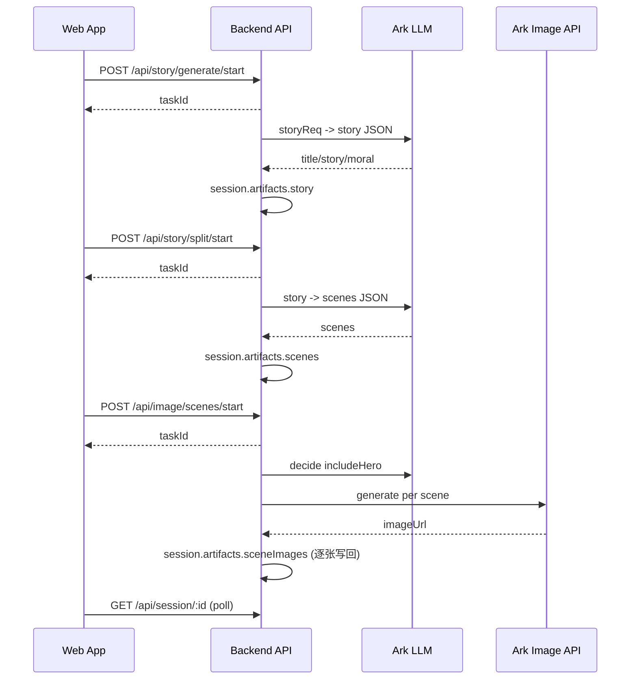
```mermaid
sequenceDiagram
  participant F as Web App
  participant B as Backend API
  participant LLM as Ark LLM
  participant Img as Ark Image API

  F->>B: POST /api/story/generate/start
  B-->>F: taskId
  B->>LLM: storyReq -> story JSON
  LLM-->>B: title/story/moral
  B->>B: session.artifacts.story

  F->>B: POST /api/story/split/start
  B-->>F: taskId
  B->>LLM: story -> scenes JSON
  LLM-->>B: scenes
  B->>B: session.artifacts.scenes

  F->>B: POST /api/image/scenes/start
  B-->>F: taskId
  B->>LLM: decide includeHero
  B->>Img: generate per scene
  Img-->>B: imageUrl
  B->>B: session.artifacts.sceneImages (逐张写回)
  F->>B: GET /api/session/:id (poll)
```

### Workflow 4: 视频生成
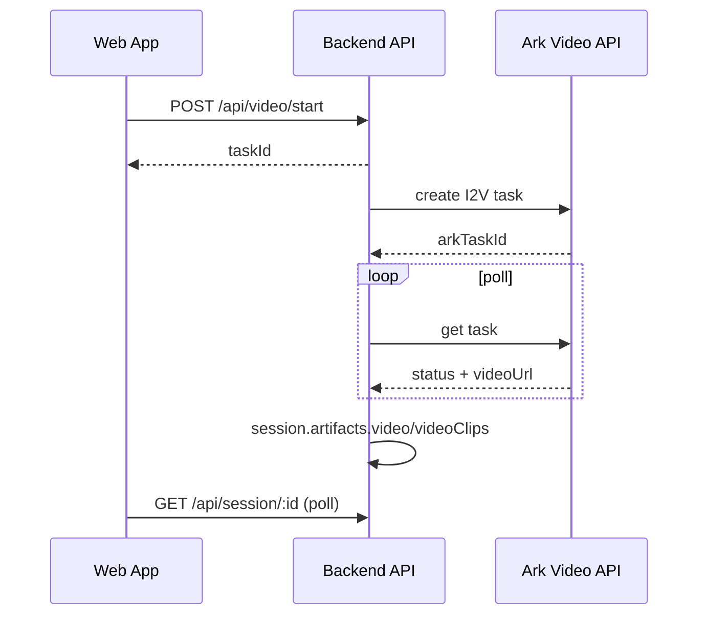
```mermaid
sequenceDiagram
  participant F as Web App
  participant B as Backend API
  participant Ark as Ark Video API

  F->>B: POST /api/video/start
  B-->>F: taskId
  B->>Ark: create I2V task
  Ark-->>B: arkTaskId
  loop poll
    B->>Ark: get task
    Ark-->>B: status + videoUrl
  end
  B->>B: session.artifacts.video/videoClips
  F->>B: GET /api/session/:id (poll)
```

### 数据流 (session.artifacts)
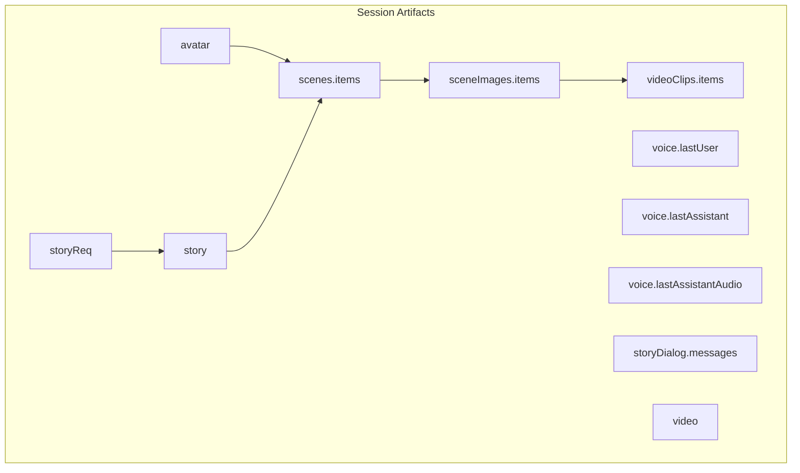
```mermaid
flowchart TB
  subgraph Session Artifacts
    A[avatar]
    V1[voice.lastUser]
    V2[voice.lastAssistant]
    V3[voice.lastAssistantAudio]
    D[storyDialog.messages]
    R[storyReq]
    S[story]
    SC[scenes.items]
    SI[sceneImages.items]
    V[video]
    VC[videoClips.items]
  end

  A --> SC
  R --> S
  S --> SC
  SC --> SI
  SI --> VC
```

### 状态管理
- 前端: localStorage 保存 sessionId, 每个页面各自维护状态与轮询
- 后端: MemorySessionStore + MemoryTaskStore, 支持 TTL 与手动 sweep

### 错误处理策略
- 后端: task.status = FAILED, error 字段返回错误原因
- 前端: 轮询失败或超时显示提示; Images 支持局部失败不中断

## 深入解析

### Deep Dive: Backend Core

#### 概览
后端为 Node.js 原生 http 服务, 负责路由分发、session/task 管理、调用生成服务并写回 artifacts。所有状态均保存在内存中, 适合演示或单实例环境。

#### 主要职责
- 统一 API 路由与参数校验
- session 管理 (TTL + artifacts 合并)
- task 管理 (进度与结果)
- 错误捕获与 CORS 处理

#### 架构图
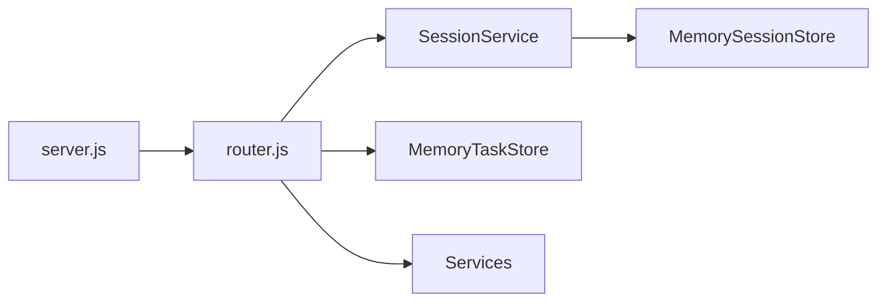
```mermaid
graph LR
  A[server.js] --> B[router.js]
  B --> C[SessionService]
  B --> D[MemoryTaskStore]
  C --> E[MemorySessionStore]
  B --> F[Services]
```

#### 关键文件
- `visiontale_backend/server.js`: http 服务器入口
- `visiontale_backend/src/router.js`: API 路由与任务创建
- `visiontale_backend/src/common/http.js`: CORS/JSON/错误处理
- `visiontale_backend/src/session/MemorySessionStore.js`: 内存 session
- `visiontale_backend/src/session/SessionService.js`: artifacts 与 stage 逻辑
- `visiontale_backend/src/task/MemoryTaskStore.js`: task CRUD

#### Session 数据模型
```json
{
  "sessionId": "...",
  "stage": "INIT",
  "artifacts": {
    "avatar": { "url": "..." },
    "storyReq": { "genre": "...", "done": true },
    "story": { "title": "...", "text": "..." },
    "scenes": { "items": [ { "sceneTitle": "..." } ] }
  },
  "createdAt": 0,
  "updatedAt": 0,
  "lastAccessAt": 0,
  "expiresAt": 0
}
```

特性:
- `get()` 默认触发 touch, 会延长 `expiresAt`
- `patch()` 合并 artifacts, 且更新 `updatedAt/lastAccessAt`
- `sweepExpired()` 定时清理过期 session

#### Task 数据模型 (示意)
```json
{
  "taskId": "...",
  "sessionId": "...",
  "type": "STORY_GEN",
  "status": "PENDING",
  "progress": 0,
  "stage": "LLM",
  "result": null,
  "error": null,
  "createdAt": 0,
  "updatedAt": 0
}
```

#### API 路由总览
- `GET /api/health`: 健康检查
- `GET /api/session/:sessionId`: 读取 session (touch TTL)
- `POST /api/session/:sessionId/artifacts/:namespace`: 写入 artifacts
- `GET /api/tts/test?text=...`: TTS 测试
- `POST /api/avatar/stylize/start`: 头像任务
- `POST /api/voice/dialog/start`: 语音对话任务
- `POST /api/story/generate/start`: 生成故事
- `POST /api/story/split/start`: 拆分场景
- `POST /api/image/scenes/start`: 生成插图
- `GET /api/image/test`: 图像测试
- `POST /api/video/start`: 生成视频
- `GET /api/task/:taskId`: 轮询任务

#### 请求与限制
- `imageBase64` 上限约 15MB
- `audioBase64` 上限约 16MB
- artifacts 单次写入限制约 200KB

#### 设计注意点
- CORS 默认允许 `*`
- 后端未校验 `X-API-Token` (前端会发送)
- session 与 task 均为内存对象, 实例重启即丢失
- `task/TaskStore.js` 与 `upload/uploadHandler.js` 目前未接入路由

#### 潜在改进
- 引入持久化存储 (Redis/DB)
- 统一 task 状态字段 (DONE vs SUCCEEDED)
- 增加鉴权与请求速率限制

### Deep Dive: Backend Services

#### 概览
后端 services 负责实际的生成流程, 以 taskId 异步运行, 并把结果写回 session.artifacts。主要包括 Avatar、Voice、Story、Image、Video 五类服务。

#### AvatarService
- 输入: `sessionId`, `imageBase64`, `styleId`, `size`
- 输出: `session.artifacts.avatar = { url, styleId, size }`
- 过程:
  - 创建任务, 更新阶段 `AVATAR_PENDING -> AVATAR_RUNNING -> AVATAR_DONE`
  - 通过 Ark Image API 进行风格化
  - 任务完成后 1 小时自动删除 task

#### VoiceService (ASR -> LLM -> TTS)
- 输入: `audioBase64`, `mimeType`
- 输出:
  - `voice.lastUser` (ASR 文本)
  - `storyDialog.messages` (多轮对话)
  - `storyReq` (结构化需求)
  - `voice.lastAssistant` 与 `voice.lastAssistantAudio`
- 关键点:
  - `sanitizeMessages` 确保 LLM messages.content 是 string
  - 解析 LLM JSON, 容错 fallback
  - `storyReq.done` 决定是否进入确认阶段

#### StoryService
- 依赖: `session.artifacts.storyReq`
- 输出: `session.artifacts.story = { title, text, moral }`
- 过程:
  - LLM 输出 JSON, 失败时使用原始文本兜底
  - stage: `STORY_GEN_PENDING -> STORY_GEN_RUNNING -> STORY_GEN_DONE`

#### ImageService
- 依赖:
  - `session.artifacts.avatar.url`
  - `session.artifacts.scenes.items[]`
- 输出: `session.artifacts.sceneImages.items[]`
- 关键点:
  - LLM 先判断每场景是否需要人类主角 (includeHero)
  - 支持断点续跑: sceneId/order 双保险
  - 网络错误重试 (指数退避 + jitter)
  - 局部失败不中断, 允许 partial success

#### VideoService
- 依赖: `sceneImages.items` + `scenes.items`
- 输出:
  - `session.artifacts.video`
  - `session.artifacts.videoClips.items`
- 过程:
  - 对每张图创建 Ark I2V task, 轮询直到成功
  - 状态写入 `creating/polling/succeeded/failed`

#### Image/Video 生成流程示意
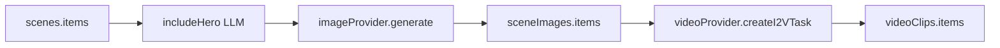
```mermaid
flowchart LR
  A[scenes.items] --> B[includeHero LLM]
  B --> C[imageProvider.generate]
  C --> D[sceneImages.items]
  D --> E[videoProvider.createI2VTask]
  E --> F[videoClips.items]
```

#### 依赖 Provider
- `ImageProvider`: Ark Images API (HTTPS JSON)
- `VideoProvider`: Ark Content Generation API
- `LlmProvider`: Ark Chat Completions
- `AsrProvider`: Volc Speech ASR
- `QwenTtsProvider`: DashScope TTS

#### 潜在改进
- 统一 task 生命周期清理策略
- 对 sceneImages 失败项提供重试 API
- 对 LLM 输出 schema 做更严格校验

### Deep Dive: Frontend SPA

#### 概览
前端是 Vue 3 + Vite 的单页应用, 通过 Vue Router 组织成 7 个步骤页面。每个页面独立拉取 session 与轮询 task, 通过 localStorage 保存 sessionId。

#### 入口与布局
- 入口: `visiontale_front/src/main.js`
- 根组件: `visiontale_front/src/App.vue`
- 布局: `visiontale_front/src/layouts/AppLayout.vue`
- 顶部进度条: `StepProgress.vue`
- 底部导航栏: `NavigationBar.vue`
- 加载状态组件: `LoadingState.vue`

#### 路由与页面
路由定义在 `visiontale_front/src/router/index.js`。

| 路由 | 页面 | 主要 API | 关键 artifacts |
| --- | --- | --- | --- |
| `/photo` | Photo.vue | POST `/api/avatar/stylize/start`, GET `/api/task/:id` | `avatar` |
| `/dialog` | Dialog.vue | POST `/api/voice/dialog/start`, GET `/api/task/:id`, GET `/api/session/:id` | `storyDialog`, `storyReq`, `voice.*` |
| `/story` | Story.vue | POST `/api/story/generate/start`, GET `/api/task/:id`, POST `/api/session/:id/artifacts/story` | `story` |
| `/split` | Split.vue | POST `/api/story/split/start`, GET `/api/task/:id`, POST `/api/session/:id/artifacts/scenes` | `scenes` |
| `/images` | Images.vue | POST `/api/image/scenes/start`, GET `/api/task/:id`, GET `/api/session/:id` | `sceneImages` |
| `/storybook` | Storybook.vue | GET `/api/session/:id` | `story`, `scenes`, `sceneImages` |
| `/video` | Video.vue | POST `/api/video/start`, GET `/api/task/:id`, GET `/api/session/:id` | `videoClips` |

#### 页面要点
- **Photo**: 拍照或上传后, 转成 dataURL 直接提交到后端
- **Dialog**: 按住说话, 上传音频并轮询 task, 再拉 session 展示对话与 TTS
- **Story**: 只在 storyReq.done 时允许生成, 可单独保存 moral
- **Split**: 拆分后可编辑并保存 scenes
- **Images**: 轮询 session 让图片逐张出现, 生成中可翻页浏览
- **Storybook**: 基于 sceneImages 构建翻页, `window.print()` 导出 PDF
- **Video**: 后端生成 clips, 前端轮询并提供播放器

#### 状态管理
- sessionId 通过 localStorage 存储 (`visiontale_session_id`)
- 每页维护自身 task 状态与轮询定时器
- 通过 `session.artifacts` 读取/写入跨页面数据

#### UI 与样式
- 主题变量定义在 `visiontale_front/src/styles/global.css`
- 使用卡通风格配色与手写字体
- LoadingState 通过 stage 与 progress 显示不同动画

#### 潜在改进
- 统一 API client, 避免重复 fetch 逻辑
- 抽离 session/task 轮询为 composable
- 增加路由守卫, 强化步骤依赖

### Deep Dive: Provider Integrations

#### 概览
后端通过多个 Provider 连接外部 AI 服务。所有调用都在服务端执行, 前端只与本地 API 通信。

#### Ark (Volc) - LLM/Image/Video
- **LLM**: `ARK_CHAT_ENDPOINT` (默认 `/api/v3/chat/completions`)
- **Image**: `ARK_IMAGE_ENDPOINT` (默认 `/api/v3/images/generations`)
- **Video**: `ARK_BASE_URL + /contents/generations/tasks`

常用环境变量:
- `ARK_API_KEY`
- `ARK_BASE_URL`
- `ARK_LLM_MODEL`
- `ARK_IMAGE_MODEL`
- `ARK_VIDEO_MODEL`
- `ARK_TIMEOUT_MS`

注意:
- `LlmProvider` 支持超时与重试
- `ImageProvider` 使用 HTTPS JSON, 失败会返回详细错误码
- `VideoProvider` 采用 create + poll 模式

#### Volc Speech ASR
- 端点: `https://openspeech.bytedance.com/api/v3/auc/bigmodel/recognize/flash`
- Headers:
  - `X-Api-App-Id`
  - `X-Api-Access-Key`
  - `X-Api-Resource-Id`
- 输入: `audio.data` (纯 base64, 不带 dataURL 前缀)

相关环境变量:
- `VOLC_SPEECH_APP_ID`
- `VOLC_SPEECH_ACCESS_KEY`
- `ASR_RESOURCE_ID`

#### DashScope TTS (Qwen3)
- 端点: `https://dashscope.aliyuncs.com/api/v1/services/aigc/multimodal-generation/generation`
- 模型: `qwen3-tts-flash`
- 输出: audio URL (wav)

相关环境变量:
- `DASHSCOPE_API_KEY`
- `TTS_TIMEOUT_MS`
- `TTS_SPEAKER` (仅允许白名单, 默认 Cherry)

#### 备用 TTS Provider (Volc Unidirectional)
- 文件: `src/voice/TtsProvider.js`
- 使用流式 JSON 拼接音频 base64
- 当前 `VoiceService` 未使用该 Provider

#### 运行环境注意事项
- Node 需支持 `fetch` (建议 Node 18+)
- 服务端为无状态, 外部 API 的失败需要任务层重试或返回错误
